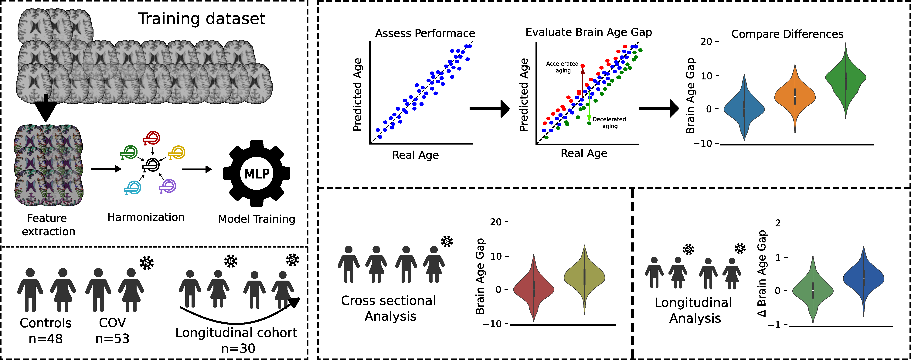

# COVID_BA

This repository contains the scripts and pipelines used for modeling MRI-derived brain age in patients with persistent post-COVID-19 headache.

The brain age model weights and code are available from the **Pyment** repository: [https://github.com/estenhl/pyment-public](https://github.com/estenhl/pyment-public)

If you found this paper or repository useful, please reference: 

[TO BE UPDATED]
